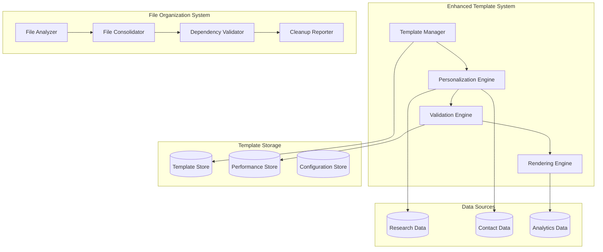

# Design Document

## Overview

This design document outlines the implementation of enhanced email templates and comprehensive file organization for the outreach system. The focus is on creating high-quality, personalized email templates while cleaning up the codebase to maintain a professional, organized structure.

## Architecture

### High-Level Architecture



## Components and Interfaces

### Enhanced Template Manager

```python
class EnhancedTemplateManager:
    def create_template(self, template_config: TemplateConfig) -> Template
    def select_optimal_template(self, recipient: Contact, context: OutreachContext) -> Template
    def render_personalized_email(self, template: Template, personalization_data: PersonalizationData) -> RenderedEmail
    def validate_template_quality(self, template: Template) -> ValidationResult
    def get_template_performance(self, template_id: str) -> PerformanceMetrics
    def a_b_test_templates(self, template_variants: List[Template]) -> TestResults
```

### Advanced Personalization Engine

```python
class AdvancedPersonalizationEngine:
    def generate_personalization_context(self, recipient: Contact, research_data: ResearchData) -> PersonalizationContext
    def create_research_connections(self, sender_background: SenderProfile, recipient_research: ResearchData) -> ConnectionPoints
    def generate_dynamic_content(self, context: PersonalizationContext, template_type: TemplateType) -> DynamicContent
    def validate_personalization_accuracy(self, content: DynamicContent) -> ValidationResult
    def optimize_content_length(self, content: DynamicContent, recipient_type: RecipientType) -> OptimizedContent
```

### File Organization System

```python
class FileOrganizer:
    def analyze_codebase(self, root_path: str) -> CodebaseAnalysis
    def identify_redundant_files(self, analysis: CodebaseAnalysis) -> RedundantFiles
    def create_organization_plan(self, analysis: CodebaseAnalysis) -> OrganizationPlan
    def execute_file_consolidation(self, plan: OrganizationPlan) -> ConsolidationResult
    def validate_system_integrity(self, consolidation_result: ConsolidationResult) -> IntegrityReport
    def generate_cleanup_report(self, consolidation_result: ConsolidationResult) -> CleanupReport
```

## Data Models

### Enhanced Template Models

```python
@dataclass
class EnhancedTemplate:
    id: str
    name: str
    type: TemplateType  # COLD_OUTREACH, WARM_INTRODUCTION, FOLLOW_UP
    category: TemplateCategory  # ACADEMIC, INDUSTRY, RESEARCH_FOCUSED
    subject_template: str
    html_body: str
    text_body: str
    personalization_variables: List[PersonalizationVariable]
    performance_metrics: PerformanceMetrics
    responsive_design: ResponsiveConfig
    accessibility_features: AccessibilityConfig
    created_at: datetime
    updated_at: datetime

@dataclass
class PersonalizationContext:
    recipient: Contact
    research_connections: List[ResearchConnection]
    sender_relevance_score: float
    available_data_quality: DataQuality
    personalization_level: PersonalizationLevel  # BASIC, STANDARD, ADVANCED, PREMIUM
    dynamic_content_blocks: Dict[str, ContentBlock]
    fallback_content: FallbackContent

@dataclass
class ResearchConnection:
    connection_type: ConnectionType  # SHARED_INTEREST, COMPLEMENTARY_WORK, CITATION_LINK
    relevance_score: float
    description: str
    supporting_evidence: List[Evidence]
    suggested_mention: str
```

### File Organization Models

```python
@dataclass
class CodebaseAnalysis:
    total_files: int
    file_categories: Dict[str, List[FileInfo]]
    duplicate_files: List[DuplicateGroup]
    redundant_files: List[FileInfo]
    dependency_graph: DependencyGraph
    organization_suggestions: List[OrganizationSuggestion]

@dataclass
class OrganizationPlan:
    files_to_move: List[FileMove]
    files_to_consolidate: List[FileConsolidation]
    files_to_remove: List[FileRemoval]
    directories_to_create: List[DirectoryCreation]
    import_updates: List[ImportUpdate]
    estimated_cleanup_impact: CleanupImpact

@dataclass
class FileInfo:
    path: str
    size: int
    last_modified: datetime
    file_type: FileType
    dependencies: List[str]
    dependents: List[str]
    functionality_hash: str
    usage_frequency: int
```

## Template Design Strategy

### Template Hierarchy

```
templates/
├── academic/
│   ├── research_focused/
│   │   ├── ai_ml_template.html
│   │   ├── engineering_template.html
│   │   └── sciences_template.html
│   ├── general/
│   │   ├── cold_outreach.html
│   │   ├── warm_introduction.html
│   │   └── follow_up.html
│   └── specialized/
│       ├── postdoc_template.html
│       └── research_director.html
├── industry/
│   ├── corporate_outreach.html
│   └── startup_outreach.html
└── shared/
    ├── components/
    │   ├── header.html
    │   ├── footer.html
    │   └── contact_info.html
    └── styles/
        ├── academic.css
        └── professional.css
```

### Personalization Levels

1. **Basic Personalization**
   - Name and university
   - General research area
   - Standard template structure

2. **Standard Personalization**
   - Recent publications (1-2)
   - Specific research interests
   - Relevant project connections

3. **Advanced Personalization**
   - Multiple publication references
   - Research area intersections
   - Detailed technical connections

4. **Premium Personalization**
   - Deep research analysis
   - Citation networks
   - Collaborative opportunity identification

## File Organization Strategy

### Proposed Clean Directory Structure

```
outreach_system/
├── src/
│   ├── core/
│   │   ├── __init__.py
│   │   ├── campaign_manager.py
│   │   ├── template_manager.py
│   │   ├── personalization_engine.py
│   │   └── research_assistant.py
│   ├── models/
│   │   ├── __init__.py
│   │   ├── contact.py
│   │   ├── campaign.py
│   │   └── template.py
│   ├── utils/
│   │   ├── __init__.py
│   │   ├── email_validator.py
│   │   └── data_processor.py
│   └── cli/
│       ├── __init__.py
│       └── main.py
├── templates/
│   ├── academic/
│   ├── industry/
│   └── shared/
├── data/
│   ├── databases/
│   ├── cache/
│   └── exports/
├── config/
│   ├── default.yaml
│   └── production.yaml
├── tests/
│   ├── unit/
│   ├── integration/
│   └── fixtures/
└── docs/
    ├── api/
    └── user_guide/
```

### File Consolidation Rules

1. **Duplicate Detection**
   - Compare file content hashes
   - Identify similar functionality
   - Merge compatible implementations

2. **Redundancy Elimination**
   - Remove unused imports
   - Consolidate similar utilities
   - Eliminate dead code

3. **Dependency Validation**
   - Update all import statements
   - Verify module accessibility
   - Test functionality preservation

## Template Quality Framework

### Design Principles

1. **Professional Appearance**
   - Clean, academic-appropriate design
   - Consistent typography and spacing
   - Mobile-responsive layout

2. **Content Structure**
   - Clear information hierarchy
   - Scannable format with visual breaks
   - Logical flow from introduction to call-to-action

3. **Personalization Integration**
   - Seamless research data incorporation
   - Natural language flow
   - Contextually relevant connections

### Validation Pipeline

```python
class TemplateValidator:
    def validate_html_structure(self, template: str) -> ValidationResult
    def check_responsive_design(self, template: str) -> ResponsiveResult
    def validate_accessibility(self, template: str) -> AccessibilityResult
    def check_email_client_compatibility(self, template: str) -> CompatibilityResult
    def validate_personalization_variables(self, template: str) -> VariableValidation
    def assess_content_quality(self, rendered_email: str) -> QualityScore
```

## Performance Optimization

### Template Caching Strategy

1. **Rendered Template Caching**
   - Cache frequently used template combinations
   - Implement intelligent cache invalidation
   - Optimize for common personalization patterns

2. **Research Data Caching**
   - Cache research connections and insights
   - Implement expiration policies
   - Optimize API call patterns

### Analytics and Optimization

```python
class TemplateAnalytics:
    def track_template_performance(self, template_id: str, metrics: EmailMetrics) -> None
    def analyze_response_patterns(self, template_type: TemplateType) -> PatternAnalysis
    def suggest_optimizations(self, performance_data: PerformanceData) -> OptimizationSuggestions
    def generate_a_b_test_results(self, test_id: str) -> TestResults
```

## Implementation Phases

### Phase 1: File Organization and Cleanup
1. Analyze current codebase structure
2. Identify redundant and duplicate files
3. Create organization plan
4. Execute file consolidation
5. Validate system integrity

### Phase 2: Enhanced Template Framework
1. Design new template architecture
2. Implement advanced personalization engine
3. Create template validation system
4. Build responsive template components

### Phase 3: Quality and Performance
1. Implement template analytics
2. Create A/B testing framework
3. Optimize rendering performance
4. Add accessibility features

### Phase 4: Integration and Testing
1. Integrate with existing campaign system
2. Comprehensive testing suite
3. Performance benchmarking
4. User acceptance testing

## Error Handling and Recovery

### Template Rendering Errors
- Graceful fallback to simpler templates
- Validation error reporting
- Automatic error recovery

### File Organization Errors
- Backup creation before changes
- Rollback mechanisms
- Dependency conflict resolution

## Security and Privacy

### Template Security
- Input sanitization for personalization data
- XSS prevention in HTML templates
- Secure handling of research data

### File System Security
- Safe file operations with validation
- Permission management
- Audit trail for file changes

This design provides a comprehensive approach to creating high-quality email templates while maintaining a clean, organized codebase that's easy to maintain and extend.