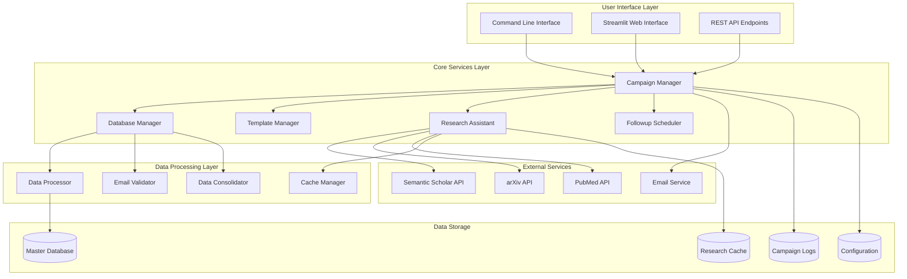

# Design Document

## Overview

This design document outlines the architecture for consolidating and optimizing the existing InternMailing outreach system. The system currently has multiple overlapping components for professor outreach (400k database), HR outreach (1800 database), research assistant integration, job application tracking, and followup management. The design focuses on creating a unified, maintainable architecture while preserving all existing functionality.

## Architecture

### High-Level Architecture



### Core Components

#### 1. Campaign Manager (Core Orchestrator)
- **Purpose**: Central coordinator for all outreach campaigns
- **Responsibilities**:
  - Campaign lifecycle management
  - Recipient selection and filtering
  - Email scheduling and sending
  - Progress tracking and reporting
  - Error handling and recovery

#### 2. Database Manager (Unified Data Access)
- **Purpose**: Centralized database operations and consolidation
- **Responsibilities**:
  - Database file detection and loading
  - Data consolidation and deduplication
  - Contact categorization (professor, HR, job)
  - Data validation and cleaning
  - Master database maintenance

#### 3. Template Manager (Email Content Generation)
- **Purpose**: Template selection, personalization, and rendering
- **Responsibilities**:
  - Template selection based on recipient type
  - Dynamic content generation
  - Research data integration
  - Personalization variable management
  - Template caching and optimization

#### 4. Research Assistant (Enhanced Publication Finder)
- **Purpose**: Automated research data collection and analysis
- **Responsibilities**:
  - Multi-source publication searching
  - Research area inference
  - Publication ranking and filtering
  - Data caching and management
  - API rate limiting and error handling

#### 5. Followup Scheduler (Automated Followup Management)
- **Purpose**: Automated followup campaign management
- **Responsibilities**:
  - Followup scheduling based on recipient type
  - Response tracking and status updates
  - Followup template selection
  - Campaign analytics and reporting

## Components and Interfaces

### Database Manager Interface

```python
class DatabaseManager:
    def consolidate_databases(self) -> ConsolidationResult
    def get_contacts_by_type(self, contact_type: ContactType) -> List[Contact]
    def add_contact(self, contact: Contact) -> bool
    def update_contact_status(self, contact_id: str, status: ContactStatus) -> bool
    def deduplicate_contacts(self) -> DeduplicationResult
    def validate_database_integrity(self) -> ValidationResult
```

### Campaign Manager Interface

```python
class CampaignManager:
    def create_campaign(self, config: CampaignConfig) -> Campaign
    def run_campaign(self, campaign_id: str) -> CampaignResult
    def pause_campaign(self, campaign_id: str) -> bool
    def resume_campaign(self, campaign_id: str) -> bool
    def get_campaign_status(self, campaign_id: str) -> CampaignStatus
    def generate_report(self, campaign_id: str) -> CampaignReport
```

### Research Assistant Interface

```python
class ResearchAssistant:
    def find_publications(self, professor: Professor) -> List[Publication]
    def infer_research_areas(self, publications: List[Publication]) -> List[ResearchArea]
    def get_cached_research(self, professor_id: str) -> Optional[ResearchData]
    def update_research_cache(self, professor_id: str, data: ResearchData) -> bool
    def batch_research_lookup(self, professors: List[Professor]) -> Dict[str, ResearchData]
```

### Template Manager Interface

```python
class TemplateManager:
    def select_template(self, recipient: Contact, campaign_type: CampaignType) -> Template
    def render_email(self, template: Template, context: EmailContext) -> RenderedEmail
    def personalize_content(self, recipient: Contact, research_data: ResearchData) -> PersonalizationContext
    def validate_template(self, template: Template) -> ValidationResult
    def get_template_performance(self, template_id: str) -> TemplateMetrics
```

## Data Models

### Core Data Models

```python
@dataclass
class Contact:
    id: str
    name: str
    email: str
    type: ContactType  # PROFESSOR, HR, JOB_APPLICATION
    affiliation: str
    department: Optional[str]
    research_areas: List[str]
    status: ContactStatus
    created_at: datetime
    updated_at: datetime
    metadata: Dict[str, Any]

@dataclass
class Campaign:
    id: str
    name: str
    type: CampaignType
    target_contacts: List[str]
    template_id: str
    status: CampaignStatus
    config: CampaignConfig
    created_at: datetime
    started_at: Optional[datetime]
    completed_at: Optional[datetime]
    metrics: CampaignMetrics

@dataclass
class ResearchData:
    professor_id: str
    publications: List[Publication]
    research_areas: List[ResearchArea]
    h_index: Optional[int]
    citation_count: Optional[int]
    last_updated: datetime
    source_apis: List[str]

@dataclass
class EmailTemplate:
    id: str
    name: str
    type: TemplateType
    subject_template: str
    body_template: str
    variables: List[str]
    performance_metrics: TemplateMetrics
    created_at: datetime
    updated_at: datetime
```

### Configuration Models

```python
@dataclass
class SystemConfig:
    smtp_settings: SMTPConfig
    api_keys: Dict[str, str]
    rate_limits: Dict[str, RateLimit]
    database_paths: DatabasePaths
    cache_settings: CacheConfig
    logging_config: LoggingConfig

@dataclass
class CampaignConfig:
    batch_size: int
    delay_between_emails: float
    max_retries: int
    enable_followups: bool
    followup_schedule: List[FollowupRule]
    personalization_level: PersonalizationLevel
```

## Error Handling

### Error Handling Strategy

1. **Graceful Degradation**: System continues operating with reduced functionality when non-critical components fail
2. **Retry Mechanisms**: Exponential backoff for transient failures (network, API rate limits)
3. **Circuit Breakers**: Prevent cascade failures by temporarily disabling failing services
4. **Comprehensive Logging**: Detailed error logging with context for debugging
5. **Recovery Procedures**: Automatic recovery from common failure scenarios

### Error Categories and Handling

```python
class ErrorHandler:
    def handle_database_error(self, error: DatabaseError) -> ErrorResponse
    def handle_api_error(self, error: APIError) -> ErrorResponse
    def handle_email_error(self, error: EmailError) -> ErrorResponse
    def handle_template_error(self, error: TemplateError) -> ErrorResponse
    def handle_network_error(self, error: NetworkError) -> ErrorResponse
```

### Recovery Mechanisms

- **Database Corruption**: Automatic backup restoration and data validation
- **API Rate Limiting**: Intelligent queuing and retry with exponential backoff
- **Email Delivery Failures**: Retry queue with different SMTP providers if configured
- **Template Rendering Errors**: Fallback to basic templates with minimal personalization
- **Research Data Failures**: Use cached data or simplified personalization

## Testing Strategy

### Unit Testing
- **Database Operations**: Test data consolidation, validation, and CRUD operations
- **Template Rendering**: Test template selection and personalization logic
- **Research Assistant**: Test publication fetching and caching mechanisms
- **Email Sending**: Mock SMTP operations and test error handling
- **Configuration Management**: Test configuration loading and validation

### Integration Testing
- **End-to-End Campaigns**: Test complete campaign workflows
- **API Integration**: Test external API interactions with rate limiting
- **Database Integration**: Test with real database files and consolidation
- **Email Integration**: Test with real SMTP providers (in test mode)
- **Template Integration**: Test template rendering with real data

### Performance Testing
- **Large Dataset Processing**: Test with 400k+ professor records
- **Concurrent Campaign Execution**: Test multiple simultaneous campaigns
- **Memory Usage**: Monitor memory consumption with large datasets
- **API Rate Limiting**: Test behavior under API constraints
- **Database Query Performance**: Optimize queries for large datasets

### Test Data Management
- **Synthetic Test Data**: Generate realistic test datasets for development
- **Data Anonymization**: Create anonymized versions of real data for testing
- **Test Environment Isolation**: Separate test and production data completely
- **Automated Test Data Generation**: Scripts to generate test scenarios

## File Organization Strategy

### Proposed Directory Structure

```
internmailing/
├── src/
│   ├── core/
│   │   ├── campaign_manager.py
│   │   ├── database_manager.py
│   │   ├── template_manager.py
│   │   ├── research_assistant.py
│   │   └── followup_scheduler.py
│   ├── models/
│   │   ├── contact.py
│   │   ├── campaign.py
│   │   ├── template.py
│   │   └── research.py
│   ├── services/
│   │   ├── email_service.py
│   │   ├── api_service.py
│   │   └── cache_service.py
│   ├── utils/
│   │   ├── data_processor.py
│   │   ├── email_validator.py
│   │   └── config_loader.py
│   └── interfaces/
│       ├── cli.py
│       ├── web_app.py
│       └── api_server.py
├── data/
│   ├── databases/
│   │   ├── master_contacts.db
│   │   └── research_cache.db
│   ├── raw/
│   │   └── (original CSV files)
│   └── processed/
│       └── (cleaned and consolidated data)
├── templates/
│   ├── academic/
│   ├── corporate/
│   └── job_application/
├── config/
│   ├── default.yaml
│   ├── production.yaml
│   └── development.yaml
├── logs/
│   ├── campaigns/
│   ├── errors/
│   └── system/
├── tests/
│   ├── unit/
│   ├── integration/
│   └── performance/
└── scripts/
    ├── consolidation/
    ├── migration/
    └── maintenance/
```

### File Consolidation Plan

1. **Identify Duplicate Functionality**: Scan for files with similar purposes
2. **Merge Compatible Components**: Combine files that serve the same function
3. **Extract Common Utilities**: Create shared utility modules
4. **Remove Obsolete Files**: Delete files that are no longer needed
5. **Update Import Statements**: Fix all import references after reorganization

### Migration Strategy

1. **Phase 1**: Create new directory structure and core modules
2. **Phase 2**: Migrate and consolidate database management components
3. **Phase 3**: Consolidate email and template management
4. **Phase 4**: Integrate research assistant and followup systems
5. **Phase 5**: Update interfaces and remove old files
6. **Phase 6**: Testing and validation of consolidated system

## Performance Optimization

### Database Optimization
- **Indexing**: Create indexes on frequently queried fields (email, name, affiliation)
- **Connection Pooling**: Reuse database connections for better performance
- **Batch Operations**: Process multiple records in single database transactions
- **Query Optimization**: Use efficient queries and avoid N+1 problems

### Caching Strategy
- **Research Data Caching**: Cache publication data to reduce API calls
- **Template Caching**: Cache rendered templates for similar recipients
- **Configuration Caching**: Cache configuration data in memory
- **Database Query Caching**: Cache frequently executed queries

### Concurrency and Parallelization
- **Async Email Sending**: Use async operations for email delivery
- **Parallel Research Lookups**: Fetch research data for multiple professors simultaneously
- **Worker Pools**: Use thread/process pools for CPU-intensive operations
- **Queue Management**: Implement job queues for long-running operations

### Memory Management
- **Streaming Processing**: Process large datasets in chunks
- **Lazy Loading**: Load data only when needed
- **Memory Monitoring**: Track memory usage and implement cleanup
- **Garbage Collection**: Optimize Python garbage collection for large datasets

## Security Considerations

### Data Protection
- **Email Encryption**: Encrypt stored email credentials
- **API Key Management**: Secure storage and rotation of API keys
- **Data Anonymization**: Remove or hash PII in logs and caches
- **Access Control**: Implement role-based access to sensitive operations

### Email Security
- **SMTP Authentication**: Use secure authentication methods
- **Rate Limiting**: Prevent abuse and maintain sender reputation
- **Bounce Handling**: Properly handle bounced emails and unsubscribes
- **Spam Prevention**: Follow email best practices to avoid spam filters

### System Security
- **Input Validation**: Validate all user inputs and file uploads
- **SQL Injection Prevention**: Use parameterized queries
- **File System Security**: Restrict file access and prevent path traversal
- **Logging Security**: Avoid logging sensitive information

## Monitoring and Analytics

### System Monitoring
- **Performance Metrics**: Track system performance and resource usage
- **Error Monitoring**: Monitor error rates and types
- **API Usage Monitoring**: Track API call rates and quotas
- **Database Health**: Monitor database performance and integrity

### Campaign Analytics
- **Delivery Rates**: Track successful email deliveries
- **Response Rates**: Monitor email opens, clicks, and replies
- **Template Performance**: Compare effectiveness of different templates
- **Recipient Engagement**: Analyze engagement patterns by recipient type

### Reporting Dashboard
- **Real-time Metrics**: Live dashboard with current campaign status
- **Historical Analysis**: Trends and patterns over time
- **Comparative Analysis**: Compare campaigns and strategies
- **Export Capabilities**: Export reports in various formats

This design provides a comprehensive architecture for consolidating your outreach system while maintaining all existing functionality and improving maintainability, performance, and reliability.