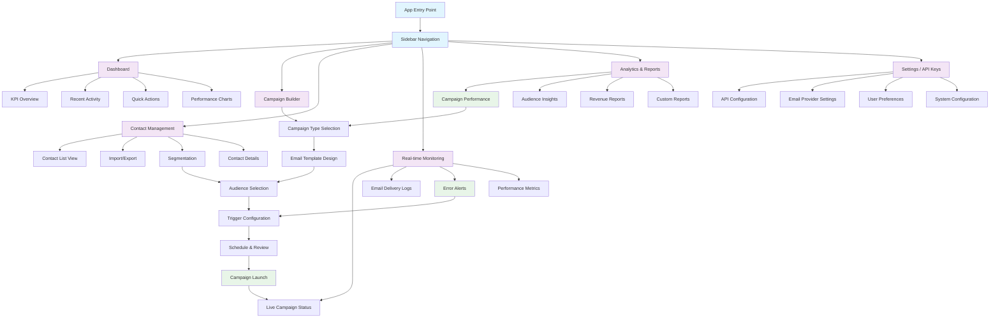
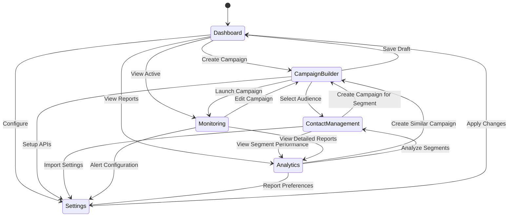

# Streamlit Email Marketing Automation Platform - Architecture Design

## Overall Application Structure

The application will use `st.sidebar` for main navigation with each page containing sub-sections using `st.tabs` where appropriate.

## Mermaid Diagram - Application Flow



## Page-by-Page UI Layout Design

### 1. Dashboard (KPIs)
```
├── Sidebar Navigation
└── Main Content
    ├── Metrics Row (4 columns)
    │   ├── Total Campaigns
    │   ├── Active Subscribers
    │   ├── Open Rate (30 days)
    │   └── Revenue (30 days)
    ├── Charts Section (2 columns)
    │   ├── Campaign Performance Timeline
    │   └── Audience Growth Chart
    └── Recent Activity Feed
```

### 2. Campaign Builder
```
├── Sidebar Navigation
└── Main Content (Stepper/Wizard Layout)
    ├── Progress Indicator
    ├── Step Content Area
    │   └── Tabs: [Template | Audience | Triggers | Schedule]
    └── Action Buttons [Back | Next | Save Draft | Launch]
```

### 3. Contact Management
```
├── Sidebar Navigation
└── Main Content
    ├── Action Bar
    │   ├── Search/Filter
    │   ├── Import Button
    │   └── Export Button
    ├── Tabs: [All Contacts | Segments | Import History]
    └── Contact Table/Grid
        └── Contact Detail Modal (on click)
```

### 4. Real-time Monitoring & Logs
```
├── Sidebar Navigation
└── Main Content
    ├── Status Overview Cards
    ├── Tabs: [Live Campaigns | Delivery Logs | Error Alerts | Performance]
    └── Auto-refreshing Data Tables/Charts
```

### 5. Analytics & Reports
```
├── Sidebar Navigation
└── Main Content
    ├── Date Range Selector
    ├── Tabs: [Campaign Analytics | Audience Insights | Revenue | Custom]
    └── Interactive Charts and Tables
```

### 6. Settings / API Keys
```
├── Sidebar Navigation
└── Main Content
    └── Tabs: [API Keys | Email Providers | Preferences | System]
        ├── Configuration Forms
        ├── Test Connection Buttons
        └── Save/Reset Actions
```

## Navigation Flow Diagram



## Streamlit Implementation Strategy

### Main Application Structure
```python
# app.py
import streamlit as st

def main():
    st.set_page_config(
        page_title="Email Marketing Platform",
        page_icon="📧",
        layout="wide",
        initial_sidebar_state="expanded"
    )
    
    # Sidebar Navigation
    with st.sidebar:
        st.title("📧 Email Marketing")
        page = st.selectbox(
            "Navigate to:",
            ["Dashboard", "Campaign Builder", "Contact Management", 
             "Real-time Monitoring", "Analytics & Reports", "Settings"]
        )
    
    # Route to appropriate page
    if page == "Dashboard":
        show_dashboard()
    elif page == "Campaign Builder":
        show_campaign_builder()
    # ... etc
```

### Key UI Components Strategy

1. **Responsive Layout**: Use `st.columns()` for responsive grids
2. **State Management**: Leverage `st.session_state` for multi-step workflows
3. **Real-time Updates**: Use `st.rerun()` with timers for monitoring page
4. **Data Tables**: Implement `st.dataframe()` with filters and search
5. **Forms**: Use `st.form()` for complex input workflows
6. **Charts**: Integrate Plotly for interactive visualizations
7. **Progress Indicators**: Custom progress bars for campaign builder

### Navigation State Management
```python
# Maintain navigation state and workflow progress
if 'current_campaign' not in st.session_state:
    st.session_state.current_campaign = None
if 'campaign_step' not in st.session_state:
    st.session_state.campaign_step = 1
```

## User Experience Flow

1. **Entry Point**: Dashboard with key metrics and quick actions
2. **Campaign Creation**: Guided workflow with clear steps and validation
3. **Contact Management**: Bulk operations with immediate feedback
4. **Monitoring**: Real-time updates with alert system
5. **Analytics**: Interactive exploration with drill-down capabilities
6. **Settings**: Organized configuration with test/validation features

This architecture provides a clear separation of concerns while maintaining intuitive user flows between related features.
